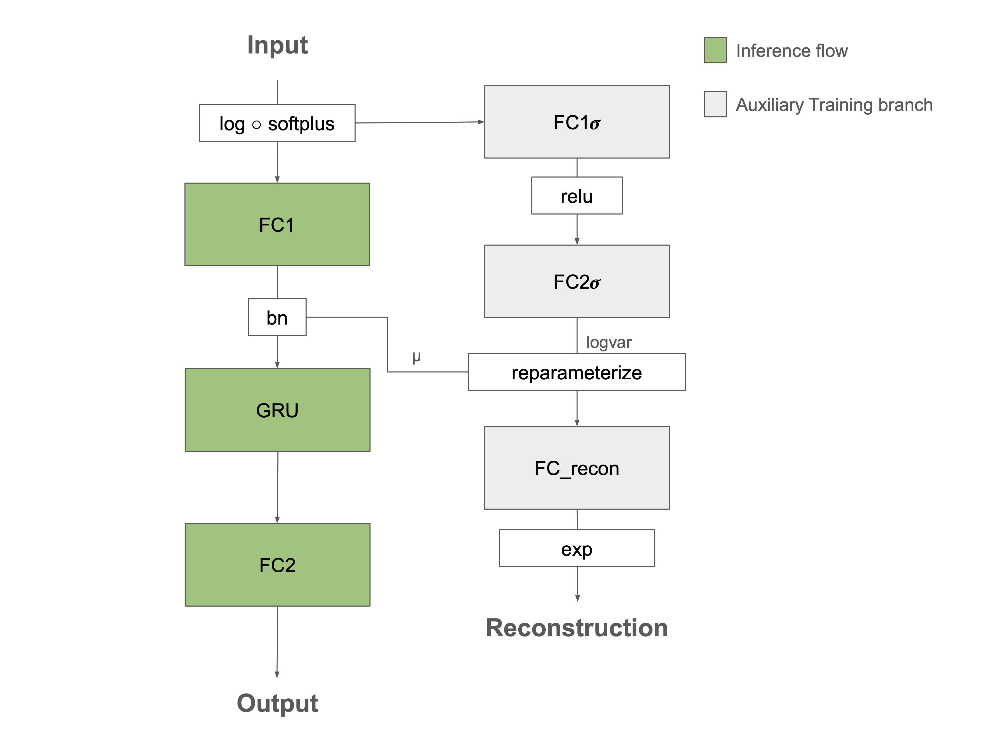

# GRU-based Motor neural decoding on non-human primates

## Description

To explore the capability of GRU layer on motor neural decoding  tasks, we built a 3-layer network with 2 FC layers at the upstream and downstream of center GRU layer. The upstream FC layer is mainly for the dimension reduction and latent factor extraction, while the downstream FC layer aims for velocity prediction.

An autoencoder (AE) is utilized in the training process to align the latent factor with input properties for better velocity prediction afterwards.




## Installation

This project is based on Primate Reaching section of [NeuroBench](https://github.com/NeuroBench/neurobench) algorithm benchmarks, which encapsulates both data download and metrics evaluation.  

Carefully follow the Developmemt instruction in the Readme file of Neurobench to build the virtual environment consistent with a deployment environment. In brief, run the following commands in the root directory of Neurobench repo to build the poetry virtual environment.
```bash
pip install poetry
poetry install
```

Activate the poetry environment for the current shell:
```bash
poetry shell
```

## Usage
1. Clone repo
```bash
git clone https://github.com/SensorsINI/MSP-2024-06-MotorDecoding.git
cd /path/to/this/repository
```
2. Reproduce benchmark scores
```bash
python benchmark_run.py 
```
3. Train
```bash
train.py -r results_recwise/ -n AEGRU -m indy -a indy_20160622_01
train.py -r results_recwise/ -n AEGRU -m indy -a indy_20160630_01
train.py -r results_recwise/ -n AEGRU -m indy -a indy_20170131_02
train.py -r results_recwise/ -n AEGRU -m loco -a loco_20170210_03
train.py -r results_recwise/ -n AEGRU -m loco -a loco_20170215_02
train.py -r results_recwise/ -n AEGRU -m loco -a loco_20170301_05
```
OR use bash script
```bash
./autorun.sh
```

> ⚠️ __Important to know__ during the training process, we utilized r2 metric computation built into `neurobench/neurobench/benchmarks/workload_metrics.py`. However, the `reset()` method of R2 class raised errors in our code. To resolve this issue, please replace the following code snippte in line 357-358:
>```python 
>self.x_labels = torch.tensor([])
>self.y_labels = torch.tensor([])
>```
> with:
>```python
>self.x_labels = None
>self.y_labels = None
>```
> And this will not affect anything during the benchmark testing.

## Data

Dataset can be found at https://zenodo.org/records/583331. The data was generated by 2 monkeys (indy, loco) during their self-paced movements to reach targets with a controlled cursor on a 8*8 grid area. Utah array with 96 channels were placed on the primary motor cortex (M1) of both monkeys. Monkey loco was implanted an additional 96-channel Utah array on the somatosensory cortex (S1). The position information of both fingertip in 3D space and cursor in 2D screen was recorded as the ground truth.

Data can also be downloaded and prepared automatically via `neurobench.datasets.PrimateReaching` method built in NeuroBench.

In this project, 6 recordings comprising 3 for each monkey were chosen from a bunch of recordings to test the performance of proposed GRU-based architecture. The 6 recordings are:

1. indy_20160622_01
2. indy_20160630_01
3. indy_20170131_02
4. loco_20170131_02
5. loco_20170215_02
6. loco_20170301_05

## Repository Structure

This repo has the following file and folder structure:

- |--`model/`: This folder contains    model definitions.

    - |-- `train/`: This folder contains model(s) specific for train.
    - |-- `test/`: This folder contains model(s) specidic for test. 
    - |-- `util.py`: utility functions for models.
- |-- `augmentators/`: This folder contains definition of data augmentation techniques.
- |-- `preprocessors/`: This folder contains definition of preprocessors.
- |-- `hyperparams/`: This folder contains configurations of model construction, training and testing.
- |-- `example_ckpts/`: This folder contains example checkpoints for reproducing reported benchmark scores.
- |-- `steps/`: This folder contains the main steps for training and testing.
- |-- `saves/`: This folder contains pre-generated data potentially used during training and testing.
- |-- `train.py`: Train and bechmark test with checkpoints produced and chosen by training process.
- |-- `benchmark_run.py`: Run benchmark on existing models.
- |-- `utils.py`: Utility functions for training.
- |-- `autorun.sh`: Automatically run `train.py` on 6 chosen recordings.

<!-- ### Contact -->
